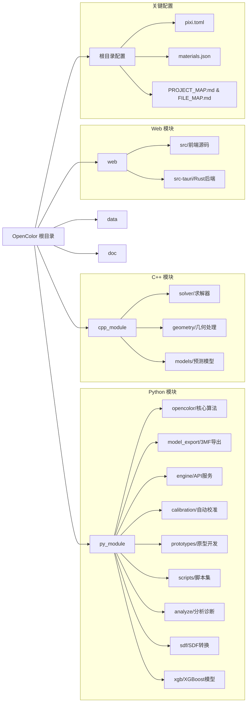

# OpenColor 文件级地图 (FILE_MAP)

本项目采用模块化结构，主要包含 Python 引擎、C++ 高性能计算模块、Vue3 + Tauri Web 前端以及相关的原型开发代码。

## 更新记录

- **2026-02-10**: 全面更新文档，反映最新代码结构
  - 更新原型模块路径（oc_prototypes_02 → oc_proto）
  - 更新环节名称（移除 _01 后缀）
  - 添加 sdf 和 xgb 模块
  - 更新 C++ 模块结构

---

## 根目录文件

| 文件 | 说明 |
|------|------|
| [pixi.toml](pixi.toml) | 全栈环境管理与任务定义（Python, Node.js, C++） |
| [README.md](README.md) | 项目主说明文档与快速入门指南 |
| [PROJECT_MAP.md](PROJECT_MAP.md) | 模块级项目结构说明 |
| [FILE_MAP.md](FILE_MAP.md) | 本文件，记录详细的文件映射 |
| [REFACTOR_MAP.md](REFACTOR_MAP.md) | 重构建议地图 |
| [DEPC_MAP.md](DEPC_MAP.md) | 依赖清理地图 |
| [LICENSE_MAP.md](LICENSE_MAP.md) | 许可证映射说明 |
| [materials.json](materials.json) | 基础材料光学参数库 |
| [.env.example](.env.example) | 环境变量配置示例 |

---

## Python 模块 (py_module/)

### 1. 核心算法库 (opencolor)

| 路径 | 说明 |
|------|------|
| [src/oc_core_02/core/](py_module/opencolor/src/oc_core_02/core/) | 核心算法（位图处理、SDF、颜色系统、网格导出） |
| [src/oc_core_02/ui/](py_module/opencolor/src/oc_core_02/ui/) | Gradio 界面组件 |
| [src/oc_core_02/utils/](py_module/opencolor/src/oc_core_02/utils/) | 工具函数（日志、路径、清单、IO） |
| [src/oc_core_02/app.py](py_module/opencolor/src/oc_core_02/app.py) | Gradio 应用入口 |
| [pyproject.toml](py_module/opencolor/pyproject.toml) | 模块构建配置 |

#### oc_core_02/core/ 核心组件

| 文件 | 功能 |
|------|------|
| `bitmap_pipeline.py` | 位图处理流程参数和预处理 |
| `bitmap_pipeline_sdf.py` | SDF 体积生成和网格挤出 |
| `color_systems.py` | 颜色系统定义（RYBW, CMYK 等） |
| `mesh_export.py` | STL/GLB 网格导出 |
| `recipes.py` | 配方管理 |
| `svg_processing.py` | SVG 处理 |
| `three_mf.py` | 3MF 处理 |
| `app_paths.py` | 应用路径管理 |
| `model_analysis.py` | 模型分析 |

---

### 2. 导出引擎 (model_export)

| 路径 | 说明 |
|------|------|
| [src/model_export/standard_3mf.py](py_module/model_export/src/model_export/standard_3mf.py) | 标准 3MF 导出逻辑 |
| [src/model_export/types.py](py_module/model_export/src/model_export/types.py) | 网格数据类型定义 |
| [src/model_export/atomic_io.py](py_module/model_export/src/model_export/atomic_io.py) | 原子 IO 操作 |
| [src/model_export/mesh_utils.py](py_module/model_export/src/model_export/mesh_utils.py) | 网格工具 |

---

### 3. 引擎服务 (engine)

| 路径 | 说明 |
|------|------|
| [src/oc_engine/main.py](py_module/engine/src/oc_engine/main.py) | 引擎主入口，JSON-RPC 请求分发 |
| [src/oc_engine/api_bridge.py](py_module/engine/src/oc_engine/api_bridge.py) | Python API 桥接（供 Tauri 调用） |
| [src/oc_engine/handlers/](py_module/engine/src/oc_engine/handlers/) | 请求处理器（bitmap, svg, board, lut, dataset, health） |
| [src/oc_engine/jobs.py](py_module/engine/src/oc_engine/jobs.py) | 异步任务管理 |
| [src/oc_engine/protocol.py](py_module/engine/src/oc_engine/protocol.py) | 通讯协议定义 |
| [src/oc_engine/schema.py](py_module/engine/src/oc_engine/schema.py) | Pydantic 数据模型 |
| [src/oc_engine/errors.py](py_module/engine/src/oc_engine/errors.py) | 错误定义 |

---

### 4. 自动校准 (calibration)

| 路径 | 说明 |
|------|------|
| [src/oc_calib/board_spec.py](py_module/calibration/src/oc_calib/board_spec.py) | 色盘规格定义 |
| [src/oc_calib/board.py](py_module/calibration/src/oc_calib/board.py) | 色盘逻辑 |
| [src/oc_calib/dataset.py](py_module/calibration/src/oc_calib/dataset.py) | 数据集管理 |
| [src/oc_calib/observation.py](py_module/calibration/src/oc_calib/observation.py) | 观测数据管理 |
| [src/oc_calib/calibration.py](py_module/calibration/src/oc_calib/calibration.py) | 校准算法 |
| [src/oc_calib/calib_types.py](py_module/calibration/src/oc_calib/calib_types.py) | 校准类型定义 |
| [src/oc_calib/aggregate.py](py_module/calibration/src/oc_calib/aggregate.py) | 数据聚合 |
| [src/oc_calib/spec_adapter.py](py_module/calibration/src/oc_calib/spec_adapter.py) | 规格适配器 |

---

### 5. 原型开发 (prototypes)

| 路径 | 说明 |
|------|------|
| [src/oc_proto/calib_board_gen/](py_module/prototypes/src/oc_proto/calib_board_gen/) | 校准板生成 |
| [src/oc_proto/calib_photo_warp/](py_module/prototypes/src/oc_proto/calib_photo_warp/) | 照片透视校正 |
| [src/oc_proto/calib_sample_build/](py_module/prototypes/src/oc_proto/calib_sample_build/) | 样本数据集构建 |
| [src/oc_proto/calib_color_rts/](py_module/prototypes/src/oc_proto/calib_color_rts/) | 色彩模型拟合（物理+GPR） |
| [src/oc_proto/gen_masks/](py_module/prototypes/src/oc_proto/gen_masks/) | 掩码生成 |
| [src/oc_proto/gen_vector/](py_module/prototypes/src/oc_proto/gen_vector/) | 矢量化（vtracer） |
| [src/oc_proto/gen_3mf/](py_module/prototypes/src/oc_proto/gen_3mf/) | 模型导出（STL/3MF） |
| [src/oc_proto/common/](py_module/prototypes/src/oc_proto/common/) | 通用工具 |

#### calib_color_rts/ 组件

| 文件/目录 | 功能 |
|-----------|------|
| `models/` | 模型实现（phys_gpr_model, new_model_template） |
| `dataset_io.py` | 数据集 IO |
| `model_io.py` | 模型 IO |
| `model_base.py` | 模型基类 |
| `optical_model.py` | 光学模型 |
| `color_space.py` | 颜色空间转换 |
| `diagnostics.py` | 诊断工具 |
| `eval_*.py` | 评估脚本 |
| `runner.py`, `rt_stack_fit_eval.py` | 运行器 |

#### gen_masks/ 组件

| 文件 | 功能 |
|------|------|
| `solver.py`, `solver_wrapper.py`, `solver_cpp_wrapper.py` | 求解器（Python + C++） |
| `optimizer.py` | 优化器 |
| `filters.py` | 过滤器 |
| `island_suppress.py` | 孤岛抑制 |
| `joint_refinement*.py` | 联合优化 |
| `visualization.py` | 可视化 |
| `stats.py` | 统计 |

---

### 6. 脚本集 (scripts)

| 路径 | 说明 |
|------|------|
| [src/oc_scripts/planning/](py_module/scripts/src/oc_scripts/planning/) | 叠层规划、蒙特卡洛模拟 |
| [src/oc_scripts/stl/](py_module/scripts/src/oc_scripts/stl/) | 3D 几何生成脚本 |
| [src/oc_scripts/svg/](py_module/scripts/src/oc_scripts/svg/) | 矢量图处理 |
| [src/oc_scripts/calibration/](py_module/scripts/src/oc_scripts/calibration/) | 校准相关脚本 |
| [src/oc_scripts/utils/](py_module/scripts/src/oc_scripts/utils/) | 工具脚本 |

---

### 7. 分析诊断 (analyze)

| 路径 | 说明 |
|------|------|
| [src/oc_analyze/scan_large_files.py](py_module/analyze/src/oc_analyze/scan_large_files.py) | 大文件扫描 |
| [src/oc_analyze/scan_long_filenames.py](py_module/analyze/src/oc_analyze/scan_long_filenames.py) | 长文件名扫描 |
| [src/oc_analyze/scan_dense_dirs.py](py_module/analyze/src/oc_analyze/scan_dense_dirs.py) | 密集目录扫描 |
| [src/oc_analyze/scan_comment.py](py_module/analyze/src/oc_analyze/scan_comment.py) | 代码注释扫描 |
| [src/oc_analyze/scan_ruff.py](py_module/analyze/src/oc_analyze/scan_ruff.py) | Ruff 检查扫描 |
| [src/oc_analyze/scan_duplicate.py](py_module/analyze/src/oc_analyze/scan_duplicate.py) | 重复文件扫描 |
| [src/oc_analyze/package_project.py](py_module/analyze/src/oc_analyze/package_project.py) | 项目打包工具 |

---

### 8. SDF 模块 (sdf)

| 路径 | 说明 |
|------|------|
| [src/oc_sdf/sdf_data_prep.py](py_module/sdf/src/oc_sdf/sdf_data_prep.py) | 数据准备（图像加载、LUT 匹配） |
| [src/oc_sdf/sdf_polygon_gen.py](py_module/sdf/src/oc_sdf/sdf_polygon_gen.py) | 多边形生成（SDF 平滑、轮廓提取） |
| [src/oc_sdf/sdf_extrude.py](py_module/sdf/src/oc_sdf/sdf_extrude.py) | 网格挤出（2D 多边形拉伸为 3D） |
| [src/oc_sdf/sdf_export.py](py_module/sdf/src/oc_sdf/sdf_export.py) | 文件导出（STL、3MF） |
| [src/oc_sdf/sdf_types.py](py_module/sdf/src/oc_sdf/sdf_types.py) | SDF 类型定义 |
| [src/oc_sdf/sdf_utils.py](py_module/sdf/src/oc_sdf/sdf_utils.py) | SDF 工具函数 |
| [src/oc_sdf/sdf_io.py](py_module/sdf/src/oc_sdf/sdf_io.py) | SVG/几何 IO |
| [src/oc_sdf/sdf_mesh.py](py_module/sdf/src/oc_sdf/sdf_mesh.py) | 网格处理 |
| [src/oc_sdf/sdf_quality.py](py_module/sdf/src/oc_sdf/sdf_quality.py) | 质量分析 |

---

### 9. XGBoost 模块 (xgb)

| 路径 | 说明 |
|------|------|
| [src/oc_xgb/xgb_model.py](py_module/xgb/src/oc_xgb/xgb_model.py) | XGBoost 模型核心（训练、预测、保存） |
| [src/oc_xgb/xgb_fit.py](py_module/xgb/src/oc_xgb/xgb_fit.py) | 物理 GPR 拟合 |
| [src/oc_xgb/xgb_features.py](py_module/xgb/src/oc_xgb/xgb_features.py) | 特征工程 |
| [src/oc_xgb/xgb_dataset.py](py_module/xgb/src/oc_xgb/xgb_dataset.py) | 数据集处理 |
| [src/oc_xgb/xgb_colorspace.py](py_module/xgb/src/oc_xgb/xgb_colorspace.py) | 颜色空间转换 |
| [src/oc_xgb/xgb_viz.py](py_module/xgb/src/oc_xgb/xgb_viz.py) | 可视化 |
| [src/oc_xgb/model_base.py](py_module/xgb/src/oc_xgb/model_base.py) | 模型基类 |
| [src/oc_xgb/model_io.py](py_module/xgb/src/oc_xgb/model_io.py) | 模型 IO |
| [src/oc_xgb/optical_model.py](py_module/xgb/src/oc_xgb/optical_model.py) | 光学模型 |
| [src/oc_xgb/color_space.py](py_module/xgb/src/oc_xgb/color_space.py) | 颜色空间 |

---

## C++ 核心模块 (cpp_module/)

| 路径 | 说明 |
|------|------|
| [CMakeLists.txt](cpp_module/CMakeLists.txt) | CMake 构建配置 |
| [vcpkg.json](cpp_module/vcpkg.json) | C++ 依赖管理（Vulkan, Pybind11, Shaderc, Manifold, Clipper2） |
| [README.md](cpp_module/README.md) | C++ 模块详细说明 |
| [src/solver/](cpp_module/src/solver/) | 求解器模块（Hill Climbing + GPR + ICM） |
| [src/geometry/](cpp_module/src/geometry/) | 几何处理（2D布尔、3D布尔、三角化、挤出） |
| [src/models/](cpp_module/src/models/) | 颜色预测模型（四通道、TMM、MCRT） |

### solver/ 组件

| 文件 | 功能 |
|------|------|
| `hill_climbing_solver.cpp/h` | Hill Climbing 求解器核心 |
| `hill_climbing_four_flux.cpp` | 四通道模型求解 |
| `hill_climbing_gpr.cpp` | GPR 模型求解 |
| `hill_climbing_rt_slab.cpp` | RT Slab 求解 |
| `icm_joint_optimizer.cpp/h` | ICM 联合优化器 |
| `vulkan_*.cpp/h` | Vulkan 加速实现 |
| `solver_pybind.cpp` | Python 绑定 |

### geometry/ 组件

| 文件 | 功能 |
|------|------|
| `clipper_ops.cpp/h` | Clipper2 布尔运算 |
| `manifold_ops.cpp/h` | Manifold 3D 布尔运算 |
| `earcut_triangulation.cpp/h` | Earcut 三角化 |
| `mesh_utils.cpp/h` | 网格工具 |
| `svg_loader.cpp/h` | SVG 加载 |
| `geometry_pybind.cpp` | Python 绑定 |

### models/ 组件

| 文件 | 功能 |
|------|------|
| `models.cpp/h` | 颜色预测模型实现 |
| `model_base.cpp/h` | 模型基类 |
| `new_model_template.cpp/h` | 新模型模板 |
| `model_pybind.cpp` | Python 绑定 |

---

## Web 前端 (web/)

| 路径 | 说明 |
|------|------|
| [package.json](web/package.json) | 前端依赖（Vue3, Tauri, Vite） |
| [vite.config.ts](web/vite.config.ts) | Vite 构建配置 |
| [tsconfig.json](web/tsconfig.json) | TypeScript 配置 |
| [src/main.ts](web/src/main.ts) | 前端入口 |
| [src/App.vue](web/src/App.vue) | 根组件 |
| [src/components/](web/src/components/) | Vue 组件（视图、卡片、模态框） |
| [src/composables/](web/src/composables/) | 组合式函数（状态管理、引擎操作） |
| [src/locales/](web/src/locales/) | 国际化（zh-CN, en-US） |
| [src/styles/](web/src/styles/) | 样式文件 |
| [src/engine_contract.ts](web/src/engine_contract.ts) | 引擎接口类型定义 |
| [src-tauri/src/lib.rs](web/src-tauri/src/lib.rs) | Tauri Rust 后端（引擎管理、资源库） |
| [src-tauri/Cargo.toml](web/src-tauri/Cargo.toml) | Rust 依赖配置 |
| [FILE_MAP.md](web/FILE_MAP.md) | Web 前端文件映射 |

---

## 数据与文档 (data/ & doc/)

| 路径 | 说明 |
|------|------|
| [data/calibration/](data/calibration/) | 校准数据（照片、warp 配置、manifest） |
| [data/image/](data/image/) | 示例图像和输出 SVG |
| [doc/Bambu-3MF/](doc/Bambu-3MF/) | 拓竹 3MF 格式文档 |
| [doc/report/](doc/report/) | 各类报告（文件名、文件大小、注释覆盖率等） |
| [doc/todo/](doc/todo/) | 待办事项 |

---

## 工具脚本 (tools/ & cpp_module/scripts/)

| 文件 | 说明 |
|------|------|
| [cpp_module/scripts/setup_cpp.py](cpp_module/scripts/setup_cpp.py) | C++ 环境设置 |
| [cpp_module/scripts/build.py](cpp_module/scripts/build.py) | 构建演示 |
| [cpp_module/tools/comment_coverage_ts/](cpp_module/tools/comment_coverage_ts/) | TypeScript 注释覆盖率工具 |

---

## 关键依赖说明

### Python (Pixi/Conda)
- **数值计算**: numpy, scipy, jax, jaxlib
- **图像处理**: opencv, pillow, scikit-image
- **几何与网格**: trimesh, shapely, mapbox-earcut, manifold3d
- **机器学习**: xgboost
- **3D 格式**: lib3mf, pygltflib
- **UI**: gradio
- **其他**: lxml, tqdm, pytest, pydantic

### C++ (Vcpkg)
- **图形**: vulkan, sdl3, imgui
- **几何**: manifold, clipper2, earcut-hpp
- **Python 绑定**: pybind11
- **着色器**: shaderc
- **SVG**: nanosvg

### Web (NPM/pnpm)
- **框架**: vue, vue-i18n, vite
- **桌面**: @tauri-apps/api, @tauri-apps/cli
- **工具**: typescript, markdown-it, @tabler/icons-webfont

---

## 目录结构图

---

## 路径变更记录

| 旧路径 | 新路径 | 变更时间 |
|--------|--------|----------|
| `py_module/prototypes/src/oc_prototypes_02/` | `py_module/prototypes/src/oc_proto/` | 2026-02 |
| `oc_prototypes_02/calib_board_gen_01/` | `oc_proto/calib_board_gen/` | 2026-02 |
| `oc_prototypes_02/calib_photo_warp_01/` | `oc_proto/calib_photo_warp/` | 2026-02 |
| `oc_prototypes_02/calib_sample_build_01/` | `oc_proto/calib_sample_build/` | 2026-02 |
| `oc_prototypes_02/calib_color_model_fit_01/` | `oc_proto/calib_color_rts/` | 2026-02 |
| `oc_prototypes_02/gen_masks_01/` | `oc_proto/gen_masks/` | 2026-02 |
| `oc_prototypes_02/gen_vector_01/` | `oc_proto/gen_vector/` | 2026-02 |
| `oc_prototypes_02/gen_model_exporter_01/` | `oc_proto/gen_3mf/` | 2026-02 |
