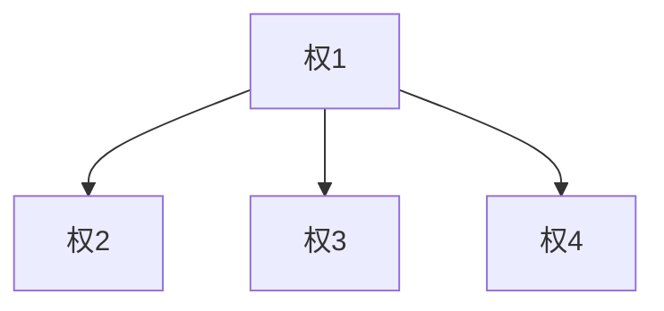
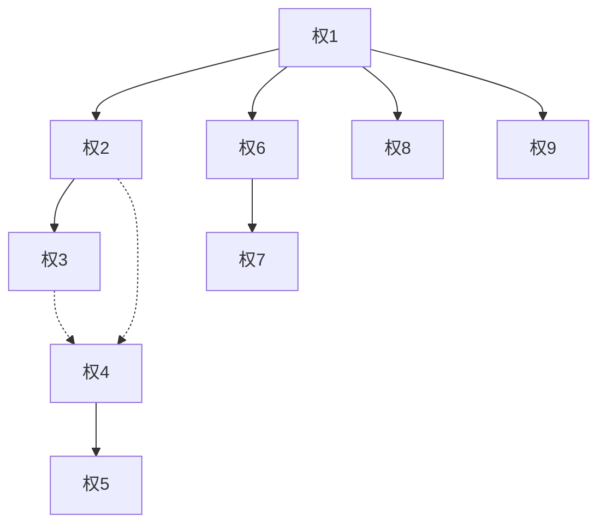
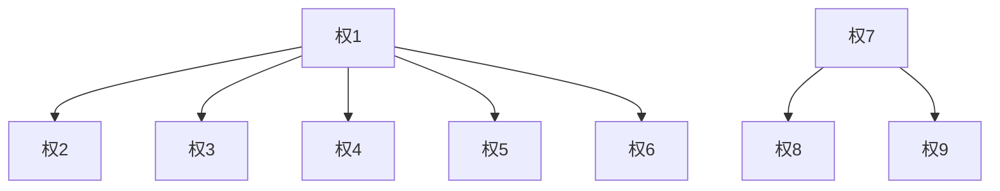

# 知识产权安全文档

> 最新信息日期：2026-02-10  
> 本文档记录与本项目相关的竞争对手专利信息，用于规避侵权风险

---

## 说明

- 以下专利均为**竞争对手专利**，非本项目自有专利
- 所有专利当前状态为**"实质审查的生效"**，尚未获得授权
- **即便如此，仍需避免实施以下专利技术方案，以防未来授权后产生侵权风险**

---

## 专利清单

| 专利号 | 专利名称 | 申请日 | 法律状态 | 来源文件 |
|--------|----------|--------|----------|----------|
| CN202511165449 | 一种基于多层色彩逆向求解算法使用FDM打印机分层混色打印平面彩色内容的方法 | 2025-08-20 | 实质审查的生效 | CN121043402A |
| CN202511191644 | 一种基于预计算材料堆叠方案数据库实现高色准与实时效果预览的3D打印方法 | 2025-10-10 | 实质审查的生效 | CN120863064A |
| CN202511464982 | 一种基于颜色贴图在三维空间中构建多层材料堆叠结构实现三维模型多色打印的方法 | 2025-10-14 | 实质审查的生效 | CN121316236A |

---

## 专利1：CN121043402A

**专利名称**：一种基于多层色彩逆向求解算法使用FDM打印机分层混色打印平面彩色内容的方法

**申请号**：CN2025111654498  
**申请日**：2025-08-20  
**公开日**：2025-12-02  
**实质审查生效日**：2025-12-19  
**IPC分类**：B29C 64/118

### 权项结构

**结构说明**：权2、权3、权4均直接引用权1（扁平结构）

### 权利要求内容

**权1（独立权利要求）**：一种使用FDM打印机打印平面彩色内容的分层混色打印方法
- 步骤一：对平面内容的色彩信息进行初步预处理，去除杂色和不明确的轮廓特征
- 步骤二：利用搭建的基于改进 Kubelka-Munk 模型的多层色彩逆向求解体系，根据目标打印色彩效果和耗材的光学特性数据，逆向精确计算出各分层（Layer1、Layer2、Layer3、Layer4）的色彩值
- 步骤三：将分层的结果按照特定的厚度和次序进行逐层打印，最终效果被呈现在打印件与热盘的接触面上

**权2**：根据权利要求1所述的方法，步骤一中将目标彩色内容进行矢量化转换，通过路径拟合消除离散噪点与模糊边缘；将净化后的矢量图形重新栅格化为位图

**权3**：根据权利要求1所述的方法，步骤二中对图片进行的色彩分层，利用了改进Kubelka-Munk模型的逆向求解获得结果

**权4**：根据权利要求1所述的方法，步骤三中的逐层打印，设置了各层层高为0.1mm，在层序上限定了深色层、高粘度层在下，浅色层、低粘度层在上的优化原则

### 侵权规避要点

- 避免使用改进Kubelka-Munk模型进行多层色彩逆向求解
- 避免将打印效果呈现在与热盘接触的底面
- 避免采用深色层在下、浅色层在上的特定层序优化

---

## 专利2：CN120863064A

**专利名称**：一种基于预计算材料堆叠方案数据库实现高色准与实时效果预览的3D打印方法

**申请号**：CN2025111916448  
**申请日**：2025-10-10  
**公开日**：2025-10-31  
**实质审查生效日**：2025-11-18  
**IPC分类**：B29C 64/386

### 权项结构

**结构说明**：
- 权2、权6、权8、权9直接引用权1
- 权3引用权2
- 权4引用权2或权3（或关系，用虚线表示）
- 权5引用权4
- 权7引用权6

### 权利要求内容

**权1（独立权利要求）**：一种基于预计算材料堆叠方案数据库实现高色准与实时效果预览的3D打印方法
- 步骤一：提供一个预先构建的材料堆叠方案数据库，记录多种预设打印材料按不同组合方式堆叠而成的物理样本各区域测量颜色与多层堆叠结构之间的映射关系
- 步骤二：获取待打印的平面彩色内容的目标颜色信息
- 步骤三：对于目标颜色，在数据库中进行查询，找到相匹配的测量颜色并获取对应的多层堆叠结构
- 步骤四：控制3D打印机根据多层堆叠结构进行逐层打印

**权2**：材料堆叠方案数据库的构建步骤包括：打印物理样本、图像采集、提取测量颜色、关联存储

**权3**：图像采集时于采集设备与物理样本之间设置偏振片，滤除表面高光反射

**权4**：图像数据处理包括网格化单元处理、模糊化处理获得均匀化颜色作为测量颜色

**权5**：网格化单元处理在相邻图像单元之间设置边缘填充（padding），避免颜色串扰

**权6**：查询过程通过GPU执行，数据库被映射为多张二维纹理，目标颜色用最邻近颜色的UV坐标表示，通过纹素采样完成查询

**权7**：实时预览步骤通过在UV坐标按区块上叠加uv采样位置偏移，从区块中心位置采样转为按区块采样，模拟打印结果视觉效果

**权8**：对输入图像进行矢量化转换，消除离散噪点和模糊边缘

**权9**：打印件呈现平面彩色内容的一面为打印过程中与打印机热床相接触的底面

### 侵权规避要点

- 避免使用预计算的材料堆叠方案数据库进行颜色查询
- 避免使用GPU纹理映射和UV坐标采样进行数据库查询
- 避免使用偏振片滤除高光的图像采集方案
- 避免使用网格化单元+边缘填充（padding）的图像处理方法
- 避免将UV采样位置偏移用于实时预览模拟

---

## 专利3：CN121316236A

**专利名称**：一种基于颜色贴图在三维空间中构建多层材料堆叠结构实现三维模型多色打印的方法

**申请号**：CN2025114649824  
**申请日**：2025-10-14  
**公开日**：2026-01-13  
**实质审查生效日**：2026-01-30  
**IPC分类**：B29C 64/118

### 权项结构

**结构说明**：
- 权2~6直接引用权1（方法权利要求组）
- 权7为独立权利要求（系统权利要求）
- 权8、权9引用权7

### 权利要求内容

**权1（独立权利要求-方法）**：一种基于颜色贴图在三维空间中构建多层材料堆叠结构实现三维模型多色打印的方法
- 步骤一：获取三维模型文件及颜色贴图，颜色贴图提供模型表面各点的目标颜色信息
- 步骤二：预设基础色材料及堆叠层数N
- 步骤三：针对目标颜色，通过颜色分解算法计算，确定由基础色材料构成的N个层级的多层堆叠序列
- 步骤四：基于多层堆叠序列，为三维模型表面生成沿法线方向的N层材料堆叠结构，生成包含多材料打印控制指令的打印路径文件
- 步骤五：控制多色3D打印机执行打印，形成材料堆叠结构

**权2**：基础色材料为8种半透明材料（青色、品红色、黄色、黑色、白色、红色、绿色、蓝色）

**权3**：堆叠层数N为3至8之间的整数

**权4**：材料堆叠结构中每一层级的厚度为0.1毫米至0.4毫米

**权5**：模型的彩色表面主要基于多层半透明材料的透射混色效应，在空间中构建多层基础色堆叠结构实现

**权6**：打印路径文件为G-code文件，多材料打印控制指令为用于切换不同基础色材料打印头的工具切换指令

**权7（独立权利要求-系统）**：一种实现三维模型多色打印的系统
- 输入模块：获取三维模型文件及颜色贴图
- 分层计算模块：针对目标颜色，通过颜色分解算法解析为多层堆叠序列
- 路径生成模块：生成包含多材料打印控制指令的打印路径文件
- 控制模块：发送打印路径文件至多材料三维打印机并控制执行

**权8**：分层计算模块配置为使用8种基础色材料和3至8的堆叠层数确定多层堆叠序列

**权9**：路径生成模块将多层堆叠结构中每一层材料设置为0.1毫米至0.4毫米的厚度

### 侵权规避要点

- 避免使用颜色贴图驱动三维模型表面多层材料堆叠的技术路线
- 避免使用8种特定基础色材料（CMYK+RGB+白）的组合方案
- 避免使用3~8层、每层0.1~0.4mm的特定堆叠参数范围
- 避免基于透射混色效应构建多层堆叠结构的方法
- 系统层面避免采用颜色贴图→分层计算→路径生成→打印控制的模块化架构

---

## 综合侵权风险分析

### 高风险技术点

| 技术点 | 涉及专利 | 风险等级 |
|--------|----------|----------|
| 预计算材料数据库+GPU纹理查询 | 专利2 | 高 |
| 改进Kubelka-Munk逆向求解 | 专利1 | 高 |
| 颜色贴图驱动三维模型多色打印 | 专利3 | 高 |
| 底面呈现打印效果 | 专利1、专利2 | 中 |
| 特定层序优化（深下浅上） | 专利1 | 中 |
| 8种基础色材料组合 | 专利3 | 中 |

### 目前的规避策略

| 序号 | 本项目实际方案 | 规避的专利 | 说明 |
|------|----------------|------------|------|
| 1 | 色盘校准使用基于Adding-Doubling的自研RT薄层堆叠算法 | 专利1（CN121043402A） | 专利1使用改进Kubelka-Munk模型进行多层色彩逆向求解，本项目使用完全不同的Adding-Doubling算法，不侵犯权1、权3 |
| 2 | 叠层生成使用爬山算法，仅记录耗材光学参数，不使用数据库查表 | 专利2（CN120863064A） | 专利2核心为预计算材料堆叠方案数据库+查询方式（权1、权2、权6），本项目采用实时计算策略，无数据库构建和查询过程 |
| 3 | 最终导出STL和3MF文件，而非G-code等机器路径文件 | 专利3（CN121316236A） | 专利3权6、权7、权9涉及G-code文件和打印控制指令，本项目输出通用3D模型格式，不包含打印机控制指令 |

---

## 更新记录

| 日期 | 更新内容 |
|------|----------|
| 2026-02-10 | 初始整理，添加三个竞争对手专利的权项结构和侵权规避要点 |
