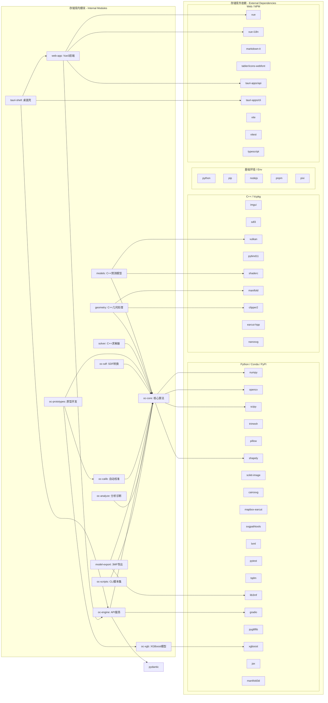

# OpenColor 项目级地图 (PROJECT_MAP)

本项目是一个全栈 3D 打印多色叠层规划系统，涵盖了从底层物理模拟到顶层 UI 交互的全流程。

## 更新记录

- **2026-02-10**: 全面更新文档，反映最新代码结构
  - 更新原型模块路径（oc_prototypes_02 → oc_proto）
  - 更新环节名称（移除 _01 后缀）
  - 添加 sdf 和 xgb 模块
  - 更新 C++ 模块结构（添加 ICM 优化器）

---

## 核心 Python 模块 (py_module/)

### oc-core (opencolor)
- **路径**: `py_module/opencolor/src/oc_core_02/`
- **功能**: 核心算法库，包含颜色空间转换、材料模型、SDF 网格生成与校准基础逻辑
- **关键组件**:
  - `core/bitmap_pipeline.py` - 位图处理流程
  - `core/bitmap_pipeline_sdf.py` - SDF 体积生成和网格挤出
  - `core/color_systems.py` - 颜色系统定义
  - `core/recipes.py` - 配方管理
  - `core/mesh_export.py` - 网格导出
  - `core/svg_processing.py` - SVG 处理
  - `ui/` - Gradio 界面组件
  - `utils/` - 工具函数（日志、路径、清单）
- **入口**: `app.py` - Gradio 应用入口

### model-export (model_export)
- **路径**: `py_module/model_export/src/model_export/`
- **功能**: 导出引擎，支持标准 3MF
- **关键组件**:
  - `standard_3mf.py` - 标准 3MF 导出（基于 lib3mf）
  - `types.py` - 网格数据类型定义
  - `atomic_io.py` - 原子 IO 操作
  - `mesh_utils.py` - 网格工具

### oc-engine (engine)
- **路径**: `py_module/engine/src/oc_engine/`
- **功能**: HTTP 服务端（JSON-RPC），将算法封装为 API 供前端调用
- **关键组件**:
  - `main.py` - 引擎主入口
  - `api_bridge.py` - Python API 桥接（供 Tauri 调用）
  - `handlers/` - 请求处理器（bitmap, svg, board, lut, dataset, health）
  - `jobs.py` - 异步任务管理
  - `schema.py` - Pydantic 数据模型

### oc-calib (calibration)
- **路径**: `py_module/calibration/src/oc_calib/`
- **功能**: 自动化校准流程，从照片中提取材料光学参数
- **关键组件**:
  - `board_spec.py` - 色盘规格定义
  - `board.py` - 色盘逻辑
  - `dataset.py` - 数据集管理
  - `observation.py` - 观测数据管理
  - `calibration.py` - 校准算法
  - `calib_types.py` - 校准类型定义

### oc-prototypes (prototypes)
- **路径**: `py_module/prototypes/src/oc_proto/`
- **功能**: 原型开发环节，包含完整的校准和生成流程
- **环节**:
  1. `calib_board_gen/` - 校准板生成
  2. `calib_photo_warp/` - 照片透视校正
  3. `calib_sample_build/` - 样本数据集构建
  4. `calib_color_rts/` - 色彩模型拟合（物理+GPR）
  5. `gen_masks/` - 掩码生成
  6. `gen_vector/` - 矢量化
  7. `gen_3mf/` - 模型导出

### oc-sdf (sdf)
- **路径**: `py_module/sdf/src/oc_sdf/`
- **功能**: 基于 SDF（有向距离场）的位图到 3D 网格转换
- **关键组件**:
  - `sdf_data_prep.py` - 数据准备
  - `sdf_polygon_gen.py` - 多边形生成
  - `sdf_extrude.py` - 网格挤出
  - `sdf_export.py` - 文件导出（STL、3MF）
  - `sdf_types.py` - SDF 类型定义

### oc-xgb (xgb)
- **路径**: `py_module/xgb/src/oc_xgb/`
- **功能**: XGBoost 机器学习模块，用于颜色预测与物理 GPR 模型拟合
- **关键组件**:
  - `xgb_model.py` - XGBoost 模型核心
  - `xgb_fit.py` - 物理 GPR 拟合
  - `xgb_features.py` - 特征工程
  - `xgb_dataset.py` - 数据集处理
  - `xgb_colorspace.py` - 颜色空间转换

### oc-scripts (scripts)
- **路径**: `py_module/scripts/src/oc_scripts/`
- **功能**: 命令行脚本集，用于快速生成、验证与实验
- **子模块**:
  - `planning/` - 叠层规划、蒙特卡洛模拟
  - `stl/` - 3D 几何生成
  - `svg/` - 矢量图处理
  - `calibration/` - 校准相关脚本

### oc-analyze (analyze)
- **路径**: `py_module/analyze/src/oc_analyze/`
- **功能**: 分析与诊断工具集
- **工具**:
  - `scan_large_files.py` - 大文件扫描
  - `scan_long_filenames.py` - 长文件名扫描
  - `scan_comment.py` - 代码注释扫描

---

## Web & 桌面应用 (web/)

### Vue 3 Frontend
- **路径**: `web/src/`
- **技术栈**: Vue 3 + Vite + TypeScript
- **关键组件**:
  - `components/` - 模块化 UI 组件
  - `composables/` - 组合式函数（状态管理、引擎操作）
  - `locales/` - 国际化（zh-CN, en-US）
  - `styles/` - 样式系统

### Tauri v2 Desktop Shell
- **路径**: `web/src-tauri/`
- **技术栈**: Rust + Tauri
- **功能**: 将 Web 界面打包为跨平台桌面应用，提供文件系统访问与原生 API 桥接
- **关键组件**:
  - `src/lib.rs` - Rust 后端主逻辑（引擎管理、资源库）
  - `src/main.rs` - 入口文件
  - `src/cpp_bridge.rs` - C++ 桥接
  - `src/engine.rs` - 引擎管理

---

## 高性能 C++ 核心 (cpp_module/)

### 求解器模块 (solver)
- **路径**: `cpp_module/src/solver/`
- **功能**: 颜色配方求解器（Hill Climbing + GPR + ICM）
- **关键组件**:
  - `hill_climbing_solver.cpp/h` - Hill Climbing 求解器核心
  - `hill_climbing_four_flux.cpp` - 四通道模型求解
  - `hill_climbing_gpr.cpp` - GPR 模型求解
  - `icm_joint_optimizer.cpp/h` - ICM 联合优化器
  - `vulkan_*.cpp/h` - Vulkan 加速实现
- **导出**: `opencolor_solver.pyd`

### 几何处理模块 (geometry)
- **路径**: `cpp_module/src/geometry/`
- **功能**: 2D/3D 布尔运算、三角化、网格挤出
- **关键组件**:
  - `clipper_ops.cpp/h` - Clipper2 布尔运算
  - `manifold_ops.cpp/h` - Manifold 3D 布尔运算
  - `earcut_triangulation.cpp/h` - Earcut 三角化
- **导出**: `opencolor_geometry.pyd`

### 颜色预测模型 (models)
- **路径**: `cpp_module/src/models/`
- **功能**: 四通道模型、TMM 传输矩阵模型
- **关键组件**:
  - `models.cpp/h` - 颜色预测模型实现
  - `model_base.cpp/h` - 模型基类
- **导出**: `opencolor_models.pyd`

---

## 外部依赖与系统级模块

### Pixi
- **功能**: 全栈环境管理器，统一管理 Python 解释器、Conda 依赖与 Node.js 工具链
- **配置**: `pixi.toml`（根目录）

### vcpkg
- **功能**: C++ 依赖管理器
- **依赖**: Vulkan, Pybind11, Shaderc, Manifold, Clipper2, earcut-hpp, nanosvg, SDL3, ImGui
- **配置**: `cpp_module/vcpkg.json`

### Tauri SDK & Cargo
- **功能**: 驱动 Rust 与前端通信的桌面端运行时
- **配置**: `web/src-tauri/Cargo.toml`

### pnpm
- **功能**: 高性能 Node.js 包管理器
- **配置**: `web/package.json`

---

## Python 核心依赖 (pixi.toml)

### 基础环境
- Python 3.11, pip, Node.js, pnpm

### 数据处理
- numpy, scipy, jax, jaxlib, xgboost

### 几何与网格
- trimesh, shapely, mapbox-earcut, manifold3d, triangle, rtree

### 图像与矢量
- opencv, pillow, scikit-image, cairosvg, svgpathtools

### 3D 格式
- lib3mf, pygltflib

### 系统与 UI
- lxml, tqdm, gradio, pydantic

### 测试与打包
- pytest, pyinstaller

---

## 数据与资产管理

### Materials Database
- `materials.json` - 基础光学参数
- `materials_calibrated.json` - 实测校准参数（在 `data/` 目录）

### 校准数据
- `data/calibration/photos_02/` - 色盘照片和 warp 配置

---

## 项目依赖关系图



---

## 典型工作流程

```
┌─────────────────────────────────────────────────────────────────┐
│                        校准流程 (Calibration)                     │
├─────────────────────────────────────────────────────────────────┤
│  calib_board_gen → calib_photo_warp → calib_sample_build         │
│         ↓                                                           │
│  calib_color_rts (训练物理+GPR模型)                                │
└─────────────────────────────────────────────────────────────────┘
                              ↓
┌─────────────────────────────────────────────────────────────────┐
│                        生成流程 (Generation)                      │
├─────────────────────────────────────────────────────────────────┤
│  gen_masks → gen_vector → gen_3mf                                │
│  (掩码生成)   (矢量化)     (导出STL/3MF)                          │
└─────────────────────────────────────────────────────────────────┘
```

---

## 开发命令

```bash
# 安装所有依赖
pixi install

# Web 开发
pixi run web-dev              # 启动前端开发服务器
pixi run web-tauri-dev        # 启动 Tauri 开发环境
pixi run web-tauri-build      # 构建 Tauri 应用

# 原型环节
pixi run p2-calib-board-gen   # 生成校准板
pixi run p2-calib-photo-warp  # 照片透视校正
pixi run p2-calib-sample-build # 构建样本数据集
pixi run p2-calib-color-rts   # 训练色彩模型
pixi run p2-gen-masks         # 生成掩码
pixi run p2-gen-vtracer       # 矢量化
pixi run p2-gen-3mf           # 导出模型

# C++ 构建
pixi run setup-cpp            # 设置 C++ 环境
```

---

## 路径变更记录

| 旧路径 | 新路径 | 变更时间 |
|--------|--------|----------|
| `py_module/prototypes/src/oc_prototypes_02/` | `py_module/prototypes/src/oc_proto/` | 2026-02 |
| `oc_prototypes_02/calib_board_gen_01/` | `oc_proto/calib_board_gen/` | 2026-02 |
| `oc_prototypes_02/calib_color_model_fit_01/` | `oc_proto/calib_color_rts/` | 2026-02 |
| `oc_prototypes_02/gen_model_exporter_01/` | `oc_proto/gen_3mf/` | 2026-02 |
