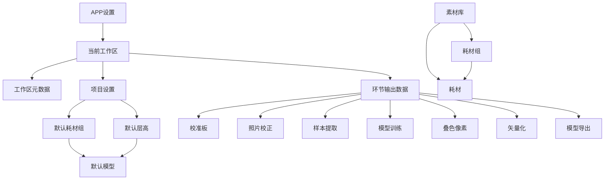

# 数据结构

本文档描述OpenColor WebUI中使用的所有数据结构，变量名采用中文+英文混合命名。

## 应用级数据

### APP设置 (AppSettings)

存储位置：`%LOCALAPPDATA%\OpenColor\settings.json`

| 字段名 | 类型 | 说明 |
|--------|------|------|
| 语言 (locale) | 字符串 | 界面语言：zh-CN/en-US/auto |
| 主题 (theme) | 字符串 | 界面主题：dark/light/auto |
| 当前工作区路径 (currentWorkspace) | 字符串 | 当前打开的工作区绝对路径 |
| 最近工作区列表 (recentWorkspaces) | 字符串数组 | 最近使用的工作区路径列表 |
| 窗口尺寸 (windowSize) | 对象 | 上次关闭时的窗口大小 |
| ├─ 宽 (width) | 数字 | 窗口宽度像素 |
| └─ 高 (height) | 数字 | 窗口高度像素 |
| 引擎路径 (enginePath) | 字符串 | Python引擎位置，auto表示自动检测 |
| GPU加速开关 (gpuAcceleration) | 布尔值 | 是否启用Vulkan GPU加速 |
| 日志级别 (logLevel) | 字符串 | 日志级别：debug/info/warn/error |

---

## 工作区级数据

### 工作区元数据 (WorkspaceMetadata)

存储位置：`{工作区根目录}/index.json`

| 字段名 | 类型 | 说明 |
|--------|------|------|
| 显示名称 (displayName) | 字符串 | 用户定义的工作区名称 |
| 创建时间 (createdAt) | 字符串 | ISO 8601格式时间戳 |
| 版本号 (version) | 字符串 | 工作区格式版本 |

### 项目设置 (ProjectSettings)

存储位置：`{工作区根目录}/settings.json`

| 字段名 | 类型 | 说明 |
|--------|------|------|
| 默认耗材组ID (defaultFilamentGroupId) | 字符串 | 该工作区默认使用的耗材组标识 |
| 默认层高毫米 (defaultLayerHeightMm) | 数字 | 默认层高，单位毫米 |
| 默认模型ID (defaultModelId) | 字符串 | 由耗材组和层高自动确定的模型标识 |
| 导出偏好 (exportPreferences) | 对象 | 默认导出选项 |
| ├─ 导出STL开关 (exportStl) | 布尔值 | 是否默认导出STL格式 |
| ├─ 导出3MF开关 (export3mf) | 布尔值 | 是否默认导出3MF格式 |
| ├─ C++加速开关 (useCppAcceleration) | 布尔值 | 是否使用C++加速导出 |
| └─ 网格修复开关 (meshRepair) | 布尔值 | 是否启用网格修复 |
| 叠色像素参数 (maskGenParams) | 对象 | 叠色像素生成默认参数 |
| ├─ 超分辨率开关 (superresEnabled) | 布尔值 | 是否启用超分辨率 |
| ├─ 超分辨率倍数 (superresScale) | 数字 | 超分辨率放大倍数 |
| ├─ 首层偏向开关 (layer0BiasEnabled) | 布尔值 | 是否启用首层颜色偏向 |
| └─ 后处理模式 (postprocessMode) | 字符串 | 后处理模式：joint/none |

---

## 环节输出数据

### 环节1：校准板生成 (Stage1BoardGen)

输出目录：`{工作区}/calib_board/`

**规格文件 (boardSpec)**：JSON格式

| 字段名 | 类型 | 说明 |
|--------|------|------|
| 板子名称 (boardName) | 字符串 | 校准板名称，如"8-Color Board A" |
| 行数 (rowCount) | 数字 | 格子行数 |
| 列数 (colCount) | 数字 | 格子列数 |
| 格子映射 (cellMap) | 对象 | 行列坐标到格子数据的映射 |
| ├─ 配方 (recipe) | 对象 | 该格子的耗材配方 |
| └─ 目标RGB (targetRgb) | 数字数组 | [R, G, B] 目标颜色 |

**打印文件 (printFiles)**：3MF格式文件数组

---

### 环节2：照片校正 (Stage2PhotoWarp)

输出目录：`{工作区}/calib_photo/`

**校正后图像 (warpedImage)**：PNG格式

**网格叠加图 (overlayImage)**：PNG格式

**校正参数 (warpParams)**：JSON格式

| 字段名 | 类型 | 说明 |
|--------|------|------|
| 四角坐标 (cornerPoints) | 坐标数组 | 四个角点的图像坐标 [{x, y}] |
| 规格引用 (specRef) | 字符串 | 引用的校准板规格文件路径 |
| 旋转次数 (rotationCount) | 数字 | 顺时针旋转90度的次数 |

---

### 环节3：样本提取 (Stage3SampleBuild)

输出目录：`{工作区}/calib_sample/`

**样本数据集 (sampleDataset)**：JSON格式

| 字段名 | 类型 | 说明 |
|--------|------|------|
| 版本 (version) | 字符串 | 数据格式版本 |
| 规格名称 (specName) | 字符串 | 来源规格文件名称 |
| 行数 (rows) | 数字 | 格子总行数 |
| 列数 (cols) | 数字 | 格子总列数 |
| 格子数组 (cells) | 对象数组 | 每个格子的数据 |
| ├─ 行号 (row) | 数字 | 格子行索引 |
| ├─ 列号 (col) | 数字 | 格子列索引 |
| ├─ 启用开关 (enabled) | 布尔值 | 该格子是否参与训练 |
| ├─ 测量RGB (measuredRgb) | 数字数组 | [R, G, B] 测量颜色 |
| ├─ 目标RGB (targetRgb) | 数字数组 | [R, G, B] 目标颜色 |
| └─ 配方 (recipe) | 对象 | 耗材配方 |

**校准前预览 (previewBefore)**：PNG格式

**校准后预览 (previewAfter)**：PNG格式

---

### 环节4：模型训练 (Stage4ModelTrain)

输出目录：`{工作区}/calib_model/`

**颜色模型 (colorModel)**：JSON格式

| 字段名 | 类型 | 说明 |
|--------|------|------|
| 版本 (version) | 字符串 | 模型格式版本 |
| 耗材组 (materialGroup) | 字符串 | 训练使用的耗材组标识 |
| 层高毫米 (layerHeightMm) | 数字 | 训练时的层高参数 |
| 训练统计 (trainingStats) | 对象 | 训练过程统计信息 |
| ├─ 训练轮数 (epochs) | 数字 | 训练迭代次数 |
| ├─ 最终损失 (finalLoss) | 数字 | 训练结束时的损失值 |
| └─ 平均DeltaE (avgDeltaE) | 数字 | 平均色差 |
| 模型参数 (modelParams) | 对象 | RT物理模型和GPR残差模型参数 |

---

### 环节5：叠色像素生成 (Stage5MaskGen)

输出目录：`{工作区}/gen_masks/`

**清单文件 (manifest)**：JSON格式

| 字段名 | 类型 | 说明 |
|--------|------|------|
| 图像名称 (imageName) | 字符串 | 输入图像文件名 |
| 像素宽 (pixelWidth) | 数字 | 图像宽度像素 |
| 像素高 (pixelHeight) | 数字 | 图像高度像素 |
| 板子毫米 (boardMm) | 数字 | 打印板子尺寸毫米 |
| 层数 (layerCount) | 数字 | 打印层数 |
| 槽位名称数组 (slotNames) | 字符串数组 | 各层耗材名称 |

**各层掩码 (layerMasks)**：PNG文件数组 `[L1_mask.png, L2_mask.png, ...]`

**误差热图 (errorHeatmap)**：PNG格式

---

### 环节6：矢量化 (Stage6Vectorize)

输出目录：`{工作区}/gen_vector/`

**清单文件 (manifest)**：JSON格式

| 字段名 | 类型 | 说明 |
|--------|------|------|
| 版本 (version) | 字符串 | 格式版本 |
| 矢量化后端 (vectorBackend) | 字符串 | 使用的后端：cv2/vtracer |
| 简化级别 (simplifyLevel) | 数字 | SVG简化程度 |

**各层SVG (layerSvgs)**：SVG文件数组 `[L1_poly.svg, L2_poly.svg, ...]`

**质量报告 (qualityReport)**：JSON格式

| 字段名 | 类型 | 说明 |
|--------|------|------|
| 位图重叠检测 (bitmapOverlapCheck) | 对象 | 掩码阶段重叠检测结果 |
| 矢量重叠检测 (vectorOverlapCheck) | 对象 | 矢量阶段重叠检测结果 |

---

### 环节7：模型导出 (Stage7Export)

输出目录：`{工作区}/gen_3mf/`

**各层STL (layerStls)**：STL文件数组 `[L1.stl, L2.stl, ...]`

**合并3MF (merged3mf)**：3MF格式文件

---

## 素材库数据

### 耗材组 (FilamentGroup)

文件格式：`oc1_mg_{名称}_{通道数}c.json`

| 字段名 | 类型 | 说明 |
|--------|------|------|
| 名称 (name) | 字符串 | 耗材组显示名称 |
| 通道数量 (channelCount) | 数字 | 颜色通道数，如4表示RGBW |
| 槽位配置 (slots) | 对象数组 | 每个槽位的配置 |
| ├─ 槽位索引 (slotIndex) | 数字 | 槽位序号 |
| ├─ 耗材ID (filamentId) | 字符串 | 该槽位使用的耗材标识 |
| └─ 层数 (layerCount) | 数字 | 该槽位打印层数 |
| 耗材引用 (filamentRefs) | 字符串数组 | 耗材组引用的所有耗材标识 |

### 耗材 (Filament)

文件格式：`oc1_fl_{名称}_{颜色}.json`

| 字段名 | 类型 | 说明 |
|--------|------|------|
| 名称 (name) | 字符串 | 耗材显示名称 |
| 颜色RGB (colorRgb) | 对象 | 耗材颜色 |
| ├─ 红 (r) | 数字 | 红色分量 0-255 |
| ├─ 绿 (g) | 数字 | 绿色分量 0-255 |
| └─ 蓝 (b) | 数字 | 蓝色分量 0-255 |
| 材料类型 (materialType) | 字符串 | 材料类型：PLA/PETG/ABS等 |

---

## 数据关系图

